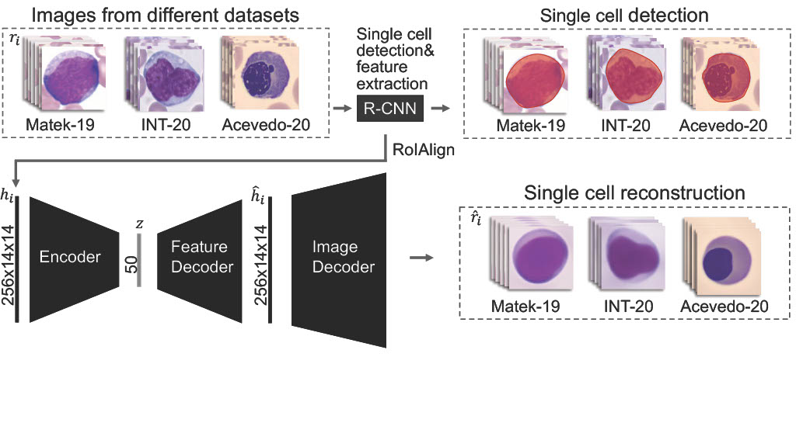

# AE-CFE: Unsupervised Cross-Domain Feature Extraction for Single Blood Cell Image Classification
This repository provides the Pytorch implementation of the paper [AE-CFE: Unsupervised Cross-Domain Feature Extraction for Single Blood Cell Image Classification](https://link.springer.com/chapter/10.1007/978-3-031-16437-8_71)
## Paper Abstract
Diagnosing hematological malignancies requires identification and classification of white blood cells in peripheral blood smears. Domain shifts caused by different lab procedures, staining, illumination, and microscope settings hamper the re-usability of recently developed machine learning methods on data collected from different sites.
Here, we propose a cross-domain adapted autoencoder to extract features in an unsupervised manner on three different datasets of single white blood cells scanned from peripheral blood smears. The autoencoder is based on an R-CNN architecture allowing it to focus on the relevant white blood cell and eliminate artifacts in the image. To evaluate the quality of the extracted features we use a simple random forest to classify single cells. We show that thanks to the rich features extracted by the autoencoder trained on only one of the datasets, the random forest classifier performs satisfactorily on the unseen datasets, and outperforms published oracle networks in the cross-domain task. Our results suggest the possibility of employing this unsupervised approach in more complicated diagnosis and prognosis tasks without the need to add expensive expert labels to unseen data.
## Model architecture
Our unsupervised feature extraction approach starts with a Mask R-CNN model which is trained to detect single white blood cells in scanned patient's blood smears. The autoencoder uses for every detected cell instance-specific features extracted to train. The autoencoder uses the instance features as input and tries to reconstruct (i) instance features and (ii) single cell images.

## Dataset
We use three different white blood cells datasets to evalute our method. The **Matek-19 dataset consists of over 18,000 annotated white blood cells from 100 acute myeloid leukameia patients. It is published by Matek et C.[Human-level recognition of blast cells in acute myeloid leukaemia with convolutional neural networks](https://www.nature.com/articles/s42256-019-0101-9)
